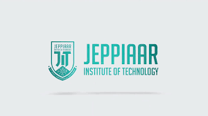

<!-- ALL-CONTRIBUTORS-BADGE:START - Do not remove or modify this section -->

<!-- ALL-CONTRIBUTORS-BADGE:END -->

## Contributors ✨

Thanks goes to these wonderful people ([emoji key](https://allcontributors.org/docs/en/emoji-key)):

<!-- ALL-CONTRIBUTORS-LIST:START - Do not remove or modify this section -->
<!-- prettier-ignore-start -->
<!-- markdownlint-disable -->
<table>
  <tbody>
    <tr>
      <td align="center" valign="top" width="14.28%"><a href="https://github.com/sonu-agi"> <b>AgiBun</b></a> <a href="https://github.com/sonu-agi/Mini-project-qr-sort/commits?author=sonu-agi" title="Code">💻</a></td>
    </tr>
  </tbody>
  <tfoot>
    <tr>
      <td align="center" size="13px" colspan="7">
        
          <a href="https://all-contributors.js.org/docs/en/bot/usage">Add your contributions</a>
        </img>
      </td>
    </tr>
  </tfoot>
</table>

<!-- markdownlint-restore -->
<!-- prettier-ignore-end -->

<!-- ALL-CONTRIBUTORS-LIST:END -->

## This project is sponsored by Jeppiaar Institute of Technology

### AI-Powered College Project Showcase

## Overview

   This is a modern, full-featured web application designed for students at the Jeppiaar Institute of Technology to showcase their academic and personal projects. It serves as a dynamic, digital portfolio where students can upload their work, and faculty, peers, and potential employers can explore the innovative projects being developed within the institution.

   The application goes beyond a simple gallery by integrating powerful AI features through the Google Gemini API to provide intelligent project analysis, summarization, and a conversational search experience.

## Core Features

**Project Submission & Management**: An intuitive, multi-step form allows students to add detailed information about their projects. Students can also edit or delete their own submissions (simulated via a registration number for this demo).

**Rich Project Display:** 

*Each project is presented on an elegant card that includes:*

   - Title, detailed description, and student authors.
   - Links to GitHub repositories, live demos, or published papers.
   - Associated documents (e.g., abstracts, presentations).
   - Tags for technologies, skills, and keywords for easy discoverability.

**Advanced Discovery Tools:**

*Multi-Faceted Filtering:* Users can filter the entire project list by academic year, department, section, project category (e.g., AI/ML, IoT), and status (Completed, In Progress).

*Sorting Options:* Projects can be sorted by submission date or alphabetically by title.

*Global Search:* A powerful search bar allows for full-text search across project titles, descriptions, and keywords.

**Easy & Modern Sharing:**
*Unique Project URLs:* Each project gets its own unique URL for direct linking.

*QR Code Generation:* A QR code is automatically generated for every project, perfect for sharing in presentations or on physical posters. Users can also toggle a "Show QR on Hover" feature for quick access.

*Share Modal:* A built-in sharing dialog provides the QR code, a one-click "Copy Link" button, and a "Share on LinkedIn" button.

*Engagement Tracking:* A view counter on each project card tracks how many times a project has been viewed, highlighting popular entries.

## AI-Powered Features (Powered by the Google Gemini API)

**This application leverages the Gemini API to provide three distinct, intelligent features:**

*AI-Curated "Projects of the Month":*

   - An automated showcase that analyzes all projects submitted in the previous month.

   - It uses a Gemini model with a carefully crafted prompt, instructing it to act as an expert engineering professor. 

   - The AI evaluates projects based on innovation, technical complexity, potential impact, and clarity.

   - It selects the top 3 projects for each class (e.g., "4th Year | CSE | Section A") and provides a written justification for each selection, explaining why the project stands out.

*On-Demand AI Summaries:*

   - Every project card features an "AI Summary" button.

   - When clicked, the application sends the project's title, description, and technologies to the Gemini API.

   - The model returns a concise, two-sentence summary, allowing users to quickly understand the core concept and significance of any project without reading the full description.

*Conversational Project Assistant (Chatbot):*

   - A floating chatbot provides a natural language interface for exploring projects.

   - When initiated, the chatbot is given the context of all available projects.

   - Users can ask questions like, "Show me projects related to robotics", "Who made the IoT Weather Station?", or "Which projects use Python?", and the AI will provide helpful, conversational answers based on the project data.

## Technology Stack
*Frontend Framework:* React with TypeScript
*Styling:* Tailwind CSS for a responsive, utility-first design.
*AI Integration:* @google/genai library for all interactions with the Google Gemini API.
*UI Components:* lucide-react for icons and qrcode.react for QR code generation.
*Architecture:* A modern, client-side application that runs directly in the browser without a backend or build step, using ES Modules and an importmap to load dependencies from a CDN.

## Run Locally
 

**Prerequisites:**  Node.js

1. Install dependencies:
   `npm install`
2. Set the `GEMINI_API_KEY` in [.env.local](.env.local) to your Gemini API key
3. Run the app:
   `npm run dev`

This project follows the [all-contributors](https://github.com/all-contributors/all-contributors) specification. Contributions of any kind welcome!